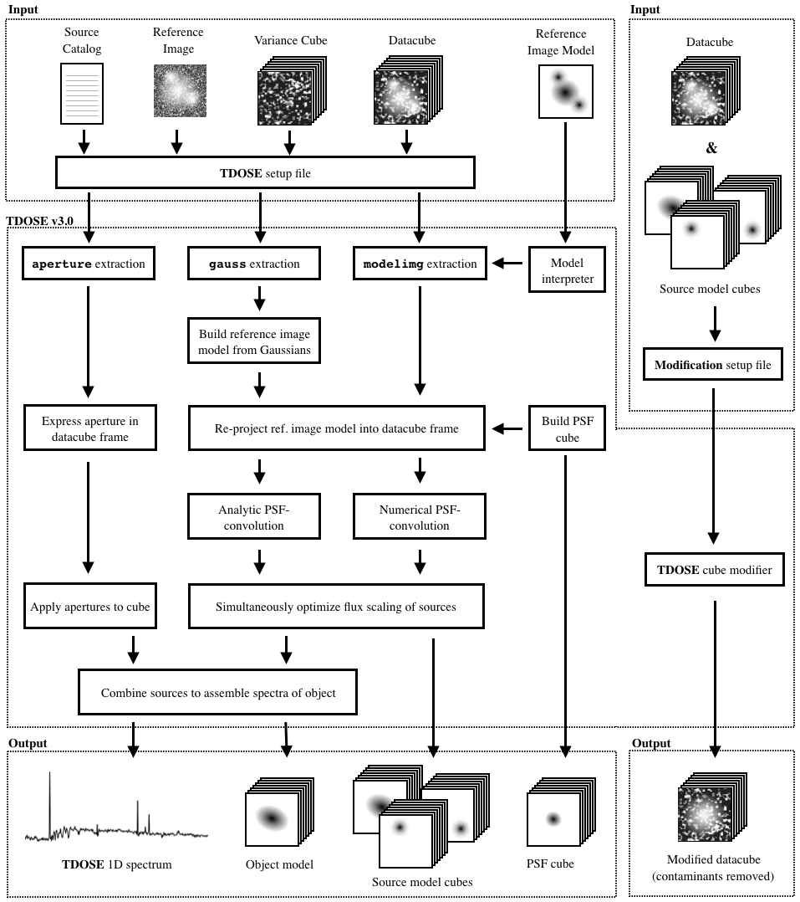

# Three Dimensional Optimal Spectral Extraction (TDOSE)

[//]: # ""

README for the optimal spectral extraction software TDOSE.

[//]: # "presented by Schmidt et al. (some day)"

TDOSE (version 3.0) is presented in [Schmidt et al. (2019, submitted to A&A)](#references). Please cite this publication if you find TDOSE useful. 

## Table of Content
<a href="TDOSElogo.png"></a>

- [Description](#description)
- [Installing TDOSE](#installing-tdose)
- [Dependencies and Requirements](#dependencies-and-requirements)
  - [Standard Packages](#standard-packages)
  - [Special Packages](#special-packages)
- [Script Overview](#script-overview)
- [TDOSE Output Overview](#tdose-output-overview) 
- [Running TDOSE](#running-tdose)
- [References](#references)
- [Flowchart of TDOSE](#flowchart-of-tdose)

## Description

The software for Three Dimensional Optimal Spectra Extraction (TDOSE) is build in Python to extract spectra of both point sources and extended sources from integral field data cubes, i.e., three dimensional data with spatial (x,y) and wavelength dimensions (λ). TDOSE was build for spectral extraction from MUSE data cubes. However, TDOSE was also build to be as broadly appliable as possible and has been succesfully applied to both CALIFA and MaNGA data cubes and should be able to extract 1D spectra from essentially any 3D FITS data cube.

TDOSE broadly follows the point source extraction software described by [Kamann, Wisotzki and Roth (2013)](#references) adding the capability of modeling sources as non-point sources, e.g., via (multiple) multivariate gaussian modeling or GALFIT modeling (in which case the GALFIT FITS model of the reference image is passed directly to TDOSE), and using these source models to guide the three dimensional extractions to approach optimal spectral extraction of extended objects.

As sources in the field-of-view are modeled and their fluxes optimized simultaneously in each individual wavelength layer, TDOSE offers natural de-blending of neighboring sources.

Below is a quick run-through of TDOSE and how to use it. Comments and/or suggestions for improvement, new features etc. are more than welcome. Please send these to Kasper B. Schmidt (kbschmidt at aip.de) or add an 'issue' via GitHub.

For further details on TDOSE (version 3.0) please see [Schmidt et al. (2019, submitted to A&A)](#references).

## Installing TDOSE

TDOSE does not require any installation. Simply cloning the TDOSE GitHub repository (or downloading one of the releses from https://github.com/kasperschmidt/TDOSE/releases) and importing the scripts should be enough.
Hence, TDOSE is "installed" by doing:
```
git clone https://github.com/kasperschmidt/TDOSE.git
```
After adding the TDOSE directory to the `PYTHONPATH` or changing location to the TDOSE directory, TDOSE can be imported in `python` with:
```python
import tdose
```
If the import does not generate any errors, i.e., if the TDOSE dependencies and requirements listed in the following section are met, TDOSE is ready for use. 
Note that TDOSE does not run on Python 3 yet (sorry).

## Dependencies and Requirements

TDOSE is written in Python and uses a range of default packages included in standard installations of Python. As TDOSE was developed using STScI's [`ureka`](http://ssb.stsci.edu/ureka/) Python instalation, "standard" here referes to packages available from a `ureka` STScI Python installation (or [`AstroConda`](#http://astroconda.readthedocs.io/en/latest/) after `ureka` is no longer supported). A list of 'special packages' that needs to be installed on top of that to get TDOSE running are also given below.

### Standard Packages

The following standard Python packages are imported in one or more of the TDOSE scripts and therefore needs to be available to run TDOSE successfully: 
`datetime`,
`collections`, 
`glob`,
`matplotlib`,
`multiprocessing`,
`numpy`,
`pdb`,
`pyfits`,
`scipy`,
`shutil`,
`subprocess`,
`sys`,
`time`, and
`warnings`.

### Special Packages

The follwoing 'special packages' also needs to be accessible to Python to run TDOSE:

`astropy`: http://www.astropy.org. Can be installed with pip. Used extensively throughout TDOSE. 

`reproject`: https://reproject.readthedocs.io. Can be installed with pip. Used to project model of reference image to data cube WCS, when the model is not a set of simple gaussians that can be build from scratch (i.e., when `source_model = modelimg` in the setup file).

## Script Overview

Appendix A of [Schmidt et al. (2019, submitted to A&A)](#references) provides a detailed description of the individual scripts of TDOSE. For detailed information please refer to the headers of the scripts and subroutines themselves. 
A schematic overview is provided in the [Flowchart of TDOSE](#flowchart-of-tdose) below.

## TDOSE Output Overview

Appendix A of [Schmidt et al. (2019, submitted to A&A)](#references) 
also presents an overview and description of the main outputs generated with TDOSE. 

## Running TDOSE

Appendix B of [Schmidt et al. (2019, submitted to A&A)](#references) provides a range of useful examples of how to produce outputs with TDOSE. For examples of how to run individual pieces of code, please refer to the individual code headers.

## References 

- [Kamann, Wisotzki and Roth (2013)](http://adsabs.harvard.edu/abs/2013A%26A...549A..71K)
- Schmidt et al. 2019, Submitted to A&A

## Flowchart of TDOSE
`TDOSEflowchart.png` (displayed below) presents a schemative overview of the different elements making up TDOSE and the workflow for the available extractions. The figure is taken from [Schmidt et al. (2019, submitted to A&A)](#references) whihc also describes the indivudal steps and outputs in detail.

<a href="TDOSEflowchart.png"></a>


