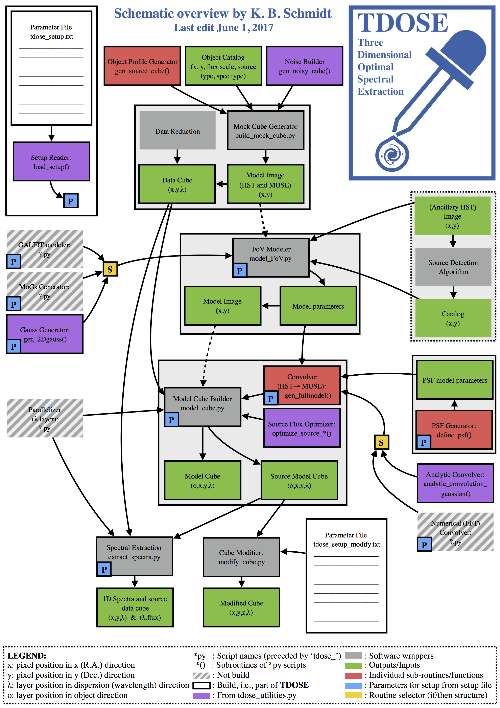

# Three Dimensional Optimal Spectral Extraction (TDOSE)

[//]: # ""

README for the optimal spectral extraction software TDOSE.

[//]: # "presented by Schmidt et al. (some day)"

TDOSE will be presented in a forthcoming publication (Schmidt et al.), until this publication has appeared, please references the TDOSE GitHub repository (https://github.com/kasperschmidt/TDOSE) if you find TDOSE useful. 

## Table of Content
<a href="TDOSElogo.png"></a>

- [Description](#description)
- [Script Overview](#script-overview)
- [Dependencies and Requirements](#dependencies-and-requirements)
  - [Standard Packages](#standard-packages)
  - [Special Packages](#special-packages)
- [Running TDOSE](#running-tdose)
  - [Default Run](#default-run-of-tdose)
  - [Individual TDOSE Function Runs](#individual-tdose-function-runs)
- [References](#references)
- [Schematic Overview of TDOSE](#schematic-overview-of-tdose)

## Description

The software for Three Dimensional Optimal Spectra Extraction (TDOSE) is build in Python to extract spectra of both point sources and extended sources from integral field data cubes, i.e., three dimensional data with spatial (x,y) and wavelength dimensions (λ). TDOSE was build for spectral extraction from MUSE data cubes. However, TDOSE was also build to be as broadly appliable as possible. Therefore, TDOSE should be able to extract 1D spectra from any 3D FITS data cube.

TDOSE broadly follows the point source extraction software described by Kamann, Wisotzki and Roth (2013) adding the capability of modeling sources as non-point sources, e.g., via (multiple) multivariate gaussian modeling or GALFIT modeling (not fully enabled yet), and using these non-point source models to guide the three dimensional extractions to approach optimal spectral extraction of extended objects.

Below is a quick run-through of TDOSE and how to use it. Comments and/or suggestions for improvement, new features etc. are more than welcome. Please send these to Kasper B. Schmidt (kbschmidt at aip.de) or add an 'issue' via GitHub.

## Script Overview

The following gives and overview of the scripts provided with the TDOSE code. For further details please refer to the headers of the scripts and subroutines themselves. 
A schematic overview of each of these scripts and their interplay is given provided in the [Schematic Overview of TDOSE](#schematic-overview-of-tdose).

- `tdose.py`
  - The main wrapper for perform the spectral extraction using TDOSE. The main command to run is `tdose.perform_extraction()`. See [Running TDOSE](#running-tdose) for details.
- `tdose_model_FoV.py`
  - Routines and functions for modeling the morphology of the objects in the field-of-view of the reference image (which are used for the optimal extraction). 
- `tdose_model_cube.py`
  - Rountines and functions for generating a 3D model cube based on the refernce image model are contained. 
- `tdose_extract_spectra.py`
  - Functions to extract and store the 1D spectra produced by the TDOSE modeling in FITS output files.
- `tdose_modify_cube.py`
  - Rountines and functions for modifying the input 3D data cube, bu subtracting the 3D models generated by TDOSE of individual (or multiple) sources from the original input data cube.
- `tdose_utilities.py`
  - Collection of useful functions used by TDOSE including functions to generate template setup files, build 2D gaussians, perform convolutions, run GALFIT, and extract sub-images and sub-cubes.
- `tdose_setup_template.txt`
  - Example template text file containig the setup for running the TDOSE functions and routines. This template can be generated with `tdose_utilities.generate_setup_template()`.
- `tdose_setup_template_modify.txt`
  - Example template text file containig the setup for modifying the input 3D data cube using the TDOSE source models. This template can be generated with `tdose_utilities.generate_setup_template_modify()`.
- `tdose_build_mock_cube.py`
  - Rountines and functions used to build mock data cubes which can be useful for testing and trouble shooting TDOSE.

## Dependencies and Requirements

TDOSE is written in Python and uses a range of default packages included in standard installations of Python. A list of 'special packages' that needs to be installed on top of that to get TDOSE running are also give below.

### Standard Packages

The following standard packages are imported in one or more of the TDOSE scripts and therefore needs to be available to run TDOSE successfully: 
`datetime`,
`collections`, 
`glob`,
`matplotlib`,
`numpy`,
`pdb`,
`pyfits`,
`scipy`,
`shutil`,
`subprocess`,
`sys`,
`time`, and
`warnings`.

### Special Packages

The follwoing 'special packages' also needs to be accessible to Python to run TDOSE:

`astropy`: http://www.astropy.org. Can be installed with pip. Used extensively throughout TDOSE. 

`reproject`: https://reproject.readthedocs.io. Used to project model of reference image to IFU WCS when the model is not a set of simple gaussians that can be build from scratch (i.e., when `source_model = modelimg` in the setup file)

## Running TDOSE

In the following a few useful examples of how to produce outputs using the TDOSE scripts are given. For examples on how to run individual pieces of code, please refer to the individual code headers.

### Default Run of TDOSE

A full TDOSE run (with minimal output) is performed by simply excecuting 
```python
import tdose
tdose.perform_extraction(setupfile='path/to/setup/tdose_setup.txt', verbose=True, verbosefull=False)
```
in a Python environment. Here `tdose_setup.txt` is a completed setup file. A template setup file can be genererated with `tdose_utilities.generate_setup_template()`. Keywords to `tdose.perform_extraction()` can be used to ignore individual steps of the TDOSE run, which can be useful for repeated runs with minor changes to the setup. See the header of `tdose.perform_extraction()` for details on these keywords.

### Individual TDOSE Function Runs

Below a few examples of how to run individual pieces of TDOSE code to perform individual tasks are given, as these might be useful as stand-alone functions.

Details of the individual steps of a full TDOSE run can be found in `tdose.py`. 

#### Model Reference with Multiple Multivariate Gaussians

More details comning soon... in the meantime take a look at `tdose.model_refimage()`.
```python
import tdose_utilities as tu
import tdose_model_FoV as tmf

pinit, fit    = tmf.gen_fullmodel(img_data,sourcecat,modeltype=setupdic['source_model'],verbose=verbosefull,
                                      xpos_col=setupdic['sourcecat_xposcol'],ypos_col=setupdic['sourcecat_yposcol'],
                                      datanoise=None,sigysigxangle=sigysigxangle,
                                      fluxscale=fluxscale,generateimage=modelimg,
                                      generateresidualimage=True,clobber=clobber,outputhdr=img_hdr,
                                      param_initguess=param_initguess)
    tu.model_ds9region(modelparam,regionfile,img_wcs,color='cyan',width=2,Nsigma=2,textlist=names,
                       fontsize=12,clobber=clobber)
```

#### Model Data Cube 

More details comning soon...
```python
import tdose_model_cube as tmc
```

#### Model Reference Image with GALFIT

More details comning soon...
```python
import tdose_utilities as tu
image           = 'path/to/refimage/referenceimage.fits'
sigmaimg        = 'path/to/sigmaimage/sigmaimage.fits'
psfimg          = 'path/to/PSFimage/PSFimage.fits'
galfitinputfile = 'path/to/inputfile/galfit_inputfile.txt'

modelparam      = path+'DATACUBE_candels-cdfs-15_v1p0_cutout_MUSEWide11503085_10x7arcsec_CUTOUT10x7arcsec_From_hlsp_candels_hst_wfc3_gs-tot_f125w_v1.0_drz_modelimage_objparam.fits'
    paramHSTinit    = tu.build_paramarray(modelparam,returninit=True,verbose=True)
    paramHSTfitted  = tu.build_paramarray(modelparam,returninit=False,verbose=True)

tu.galfit_buildinput_fromparamlist(galfitinputfile,paramHSTfitted,image,objecttype='gaussian',sigmaimg=None,psfimg=psfimg,
                                       platescale=[0.03,0.03],magzeropoint=25.947,convolvebox=[500,500],verbose=True)

galfitoutput = tu.galfit_run(galfitinputfile,noskyest=False)
```

#### Remove Sources (Models) from Initial Data Cube

More details comning soon...
```python
import tdose_modify_cube as tmoc

sourcemodelcube = path+'tdose_source_model_cube.fits'
datacube        = path+'datacube.fits'

modified_cube   = tmoc.remove_object(datacube, sourcemodelcube, objects=[1,2,10], remove=True, dataext=0, sourcemodelext=0, savecube='removesource1and2and10', verbose=True)
```

#### Build Mock Data Cube

The following will build a mock data cube based on the source catalog provided of spatial dimensions (200,150) and 100 wavelength slices. A Moffat PSF will be applied and Gaussian noise will be added.
```python
import tdose_build_mock_cube as tbmc

sourcecat       = 'mock_cube_sourcecat161213_all.fits'
cube_dim        = [100,200,150]
noisetype       = 'gauss'
noise_gauss_std = 0.03
psf             = 'moffat'
psf_param       = [10.0,[1.1,1.3,1.5]]

outputcube      = tbmc.build_cube(sourcecat, cube_dim=cube_dim, clobber=False, noisetype=noise, noise_gauss_std=noise_gauss_std, psf=psf, psf_param=psf_param)
```
Here, the `sourcecat` is a fits catalog containing x and y pixel positions, a flux scale, indicators of the source (model) types and spectral (model) types. For further details see header of `tbmc.build_cube()`. The `psf*` paramters define the psf model to convolve the cube with using `tdose_utilities.gen_psfed_cube()`.

## References 

- [Kamann, Wisotzki and Roth (2013)](http://adsabs.harvard.edu/abs/2013A%26A...549A..71K)

## Schematic Overview of TDOSE
TDOSE_illustration.png (displayed below) presents a schemative overview of the different elements, functions and routines making up TDOSE.

<a href="TDOSE_illustration.png"></a>


